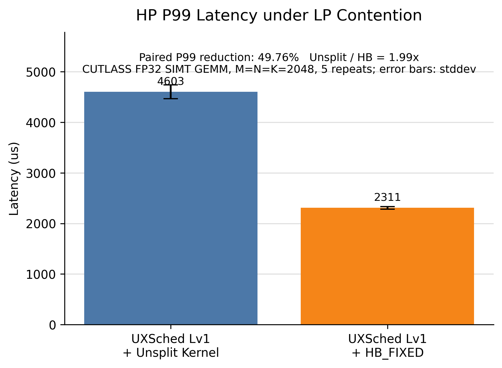
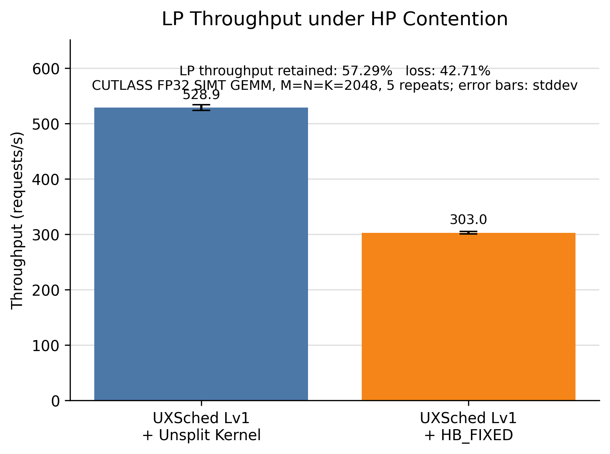

# HB-UXSched

**HB-UXSched** is a research prototype that integrates Hummingbird-style GPU
kernel splitting into the UXSched user-space accelerator scheduling framework.

The project targets a common multi-process GPU sharing problem: high-priority
real-time inference can be delayed by an already-running low-priority GPU
kernel. UXSched decides which process queue should run; the HB_FIXED runtime
strategy adds finer-grained switch points by splitting eligible low-priority
CUDA kernels into multiple child launches.

This repository is based on UXSched and extends its CUDA backend with:

- a single UXSched-owned CUDA shim;
- CUDA Runtime and Driver API interception;
- stream-to-XQueue association for default and explicit CUDA streams;
- CUTLASS Runtime launch metadata bridging;
- fixed-size low-priority kernel splitting through `HB_FIXED`;
- correctness, synchronization, fallback, and realtime HP/LP benchmark tooling.

No operating-system kernel changes and no NVIDIA driver changes are required.

## Current Scope

Implemented and validated paths:

- `NATIVE`: original UXSched CUDA behavior.
- `HB_FIXED`: fixed-size splitting for verified low-priority CUDA kernels.
- CUTLASS FP32 SIMT GEMM Runtime launch path on CUDA 12.8 / SM120.
- Global HPF scheduling with independent HP and LP client processes.

Intentionally not claimed as complete:

- automatic split-size selection;
- online profiling;
- kernel-tick scheduling;
- bubble detection or consolidation;
- CUDA Graph splitting;
- cuBLAS/cuDNN closed-kernel splitting;
- Transformer workload validation;
- multi-GPU load balancing;
- non-CUDA accelerator backends.

## Architecture

```text
Application / CUTLASS worker
  |
  | CUDA Runtime / Driver API
  v
UXSched CUDA shim (single LD_PRELOAD hook)
  |
  | stream/context -> XQueue association
  v
UXSched Global xserver (HPF policy)
  |
  | grants queue execution rights
  v
CUDA HAL runtime strategy
  |-- NATIVE: submit original kernel command
  |
  `-- HB_FIXED:
        check priority, XQueue, PTX, allowlist, parameters
        transform verified LP kernel
        split parent launch into child launches
        submit child commands through the same XQueue
        complete parent only after all children finish
```

Key invariant: **UXSched remains the only global scheduler**. HB_FIXED does not
start a second scheduler and does not bypass XQueue submission.

## Runtime Strategies

| Strategy | Status | Meaning |
|---|---|---|
| `NATIVE` | Implemented | Original UXSched CUDA launch path |
| `HB_FIXED` | Implemented | Fixed-size LP kernel splitting for verified kernels |
| `HB_RUNTIME` | Native fallback | Reserved for future full Hummingbird runtime |
| `AUTO` | Native fallback | Reserved for future capability-aware selection |

High-priority kernels are always passthrough and are never split. Unsupported
low-priority kernels safely fall back to Native.

## CUTLASS Realtime Result

The main performance experiment replaces the original PyTorch/TorchVision
workload shape with an open-source CUTLASS GEMM workload:

- GPU: NVIDIA GeForce RTX 5060 Laptop GPU
- CUDA Toolkit: 12.8
- CUTLASS revision: `ad7b2f5`
- Kernel: FP32 SIMT GEMM
- Shape: `M=N=K=2048`
- Scheduler: UXSched Global HPF
- HP priority: `10`
- LP priority: `-10`
- HP requests: `200`
- HP period: `30000 us`
- LP duration: `8000 ms`
- Repeats: `5`
- HB fixed split size: `52` blocks

In five paired repeats, under the same HP+LP contention:

| System | HP P99 latency | LP throughput |
|---|---:|---:|
| UXSched Lv1 + Unsplit Kernel | `4603.048 us` | `528.883 requests/s` |
| UXSched Lv1 + HB_FIXED | `2310.521 us` | `302.960 requests/s` |

Derived metrics:

- HP P99 reduction: **49.76%**
- HP P95 reduction: **50.01%**
- HP mean latency reduction: **42.35%**
- LP throughput retained: **57.29%**
- LP throughput loss: **42.71%**

This is a latency/throughput trade-off, not a claim that HB_FIXED improves all
metrics simultaneously.





## Why `split_blocks=52`?

For the current RTX 5060 Laptop GPU and this CUTLASS kernel:

```text
SM count = 26
max threads / SM = 1536
registers / SM = 65536
shared memory / SM = 102400 bytes

threads / block = 256
registers / thread = 128
static shared memory / block = 1024 bytes
dynamic shared memory / block = 16640 bytes
```

Resource limits:

```text
thread_limit        = floor(1536 / 256) = 6 blocks/SM
shared_memory_limit = floor(102400 / (1024 + 16640)) = 5 blocks/SM
register_limit      = floor(65536 / (128 * 256)) = 2 blocks/SM
```

The register limit dominates:

```text
active_blocks_per_SM = min(6, 5, 2) = 2
split_blocks = 26 SM * 2 blocks/SM = 52 blocks
```

`52` is a fixed, hardware-aware setting for this GPU and this kernel. It is not
automatic profiling and is not a global optimum for other GPUs or kernels.

## Repository Layout

```text
platforms/cuda/shim/        CUDA Driver/Runtime interception
platforms/cuda/hal/         CUDA HAL, runtime strategy, HB split backend
preempt/                    XQueue, HwQueue, command buffering
service/                    Global xserver and scheduler service
benchmarks/cutlass/         CUTLASS launch probe and realtime worker
tools/                      Build, smoke, sweep, plotting, and analysis scripts
docs/                       Design notes and benchmark plans
docs/assets/readme/         README figures
```

## Build

The CUTLASS path currently assumes CUDA 12.8 and native SM120 support.

```bash
export CUDA_HOME=/usr/local/cuda-12.8
export CUDACXX=/usr/local/cuda-12.8/bin/nvcc
export CUTLASS_ROOT=/home/zm/project/cutlass
export XSCHED_CUDA_LIB=/usr/lib/wsl/lib/libcuda.so.1
export CUXTRA_CUDA_LIB=/usr/lib/wsl/lib/libcuda.so.1
```

Build UXSched with the HB split backend enabled:

```bash
cmake -S . -B build-hb-cu128 \
  -DPLATFORM_CUDA=ON \
  -DUXSCHED_ENABLE_HB_SPLIT=ON \
  -DSHIM_SOFTLINK=ON \
  -DBUILD_TEST=OFF \
  -DCMAKE_BUILD_TYPE=Release

cmake --build build-hb-cu128 --target halcuda shimcuda xserver -j2
```

Build the CUTLASS probes and realtime worker:

```bash
bash tools/build_cutlass_launch_probe.sh \
  --build-dir build-cutlass-cu128 \
  --cutlass-root "$CUTLASS_ROOT" \
  --cuda-home "$CUDA_HOME" \
  --cuda-compiler "$CUDACXX"
```

## Compatibility Probe

Before running realtime experiments, verify that CUTLASS Runtime launches reach
the HB_FIXED backend:

```bash
env -u LD_PRELOAD -u XSCHED_POLICY -u HB_TASK_PRIORITY \
  XSCHED_CUDA_LIB=/usr/lib/wsl/lib/libcuda.so.1 \
  CUXTRA_CUDA_LIB=/usr/lib/wsl/lib/libcuda.so.1 \
  bash tools/run_cutlass_launch_probe.sh \
    --output-dir "results/cutlass_launch_probe_$(date +%Y%m%d_%H%M%S)" \
    --build-dir build-cutlass-cu128 \
    --uxsched-build build-hb-cu128 \
    --m 2048 --n 2048 --k 2048 \
    --iterations 1 \
    --warmup 0 \
    --stream explicit \
    --split-blocks 64
```

Passing evidence should include:

- Runtime launch interception;
- Runtime function resolution;
- HB module/function metadata registration;
- transformed module load;
- parent launch submitted;
- multiple child launches submitted;
- split group and parent completion;
- correctness pass;
- fallback count `0`;
- `NO_XQUEUE` count `0`.

## Realtime HP/LP Benchmark

Run the repeat=1 smoke test first:

```bash
env -u LD_PRELOAD -u XSCHED_POLICY -u HB_TASK_PRIORITY \
  XSCHED_CUDA_LIB=/usr/lib/wsl/lib/libcuda.so.1 \
  CUXTRA_CUDA_LIB=/usr/lib/wsl/lib/libcuda.so.1 \
  bash tools/run_cutlass_realtime_compare.sh \
    --output-dir "results/cutlass_realtime_smoke_$(date +%Y%m%d_%H%M%S)" \
    --uxsched-build build-hb-cu128 \
    --cutlass-build build-cutlass-cu128 \
    --m 2048 --n 2048 --k 2048 \
    --warmup 5 \
    --hp-requests 20 \
    --hp-period-us 30000 \
    --lp-duration-ms 1500 \
    --split-blocks 52 \
    --repeat 1 \
    --systems standalone_hp,uxsched_native_hp_lp,uxsched_hb_fixed_hp_lp \
    --cooldown-sec 5
```

Run the repeat=5 formal comparison:

```bash
env -u LD_PRELOAD -u XSCHED_POLICY -u HB_TASK_PRIORITY \
  XSCHED_CUDA_LIB=/usr/lib/wsl/lib/libcuda.so.1 \
  CUXTRA_CUDA_LIB=/usr/lib/wsl/lib/libcuda.so.1 \
  bash tools/run_cutlass_realtime_compare.sh \
    --output-dir "results/cutlass_realtime_compare_$(date +%Y%m%d_%H%M%S)" \
    --uxsched-build build-hb-cu128 \
    --cutlass-build build-cutlass-cu128 \
    --m 2048 --n 2048 --k 2048 \
    --warmup 5 \
    --hp-requests 200 \
    --hp-period-us 30000 \
    --lp-duration-ms 8000 \
    --split-blocks 52 \
    --repeat 5 \
    --systems standalone_hp,uxsched_native_hp_lp,uxsched_hb_fixed_hp_lp \
    --cooldown-sec 5
```

Generate final figures from an existing result directory:

```bash
python3 tools/plot_cutlass_realtime_results.py \
  --result-dir results/<cutlass_realtime_result_dir> \
  --formats png,pdf,svg \
  --dpi 300
```

## Split-size Sweep

To validate the fixed split-size choice under a unified configuration:

```bash
env -u LD_PRELOAD -u XSCHED_POLICY -u HB_TASK_PRIORITY \
  XSCHED_CUDA_LIB=/usr/lib/wsl/lib/libcuda.so.1 \
  CUXTRA_CUDA_LIB=/usr/lib/wsl/lib/libcuda.so.1 \
  bash tools/run_cutlass_split_size_sweep.sh \
    --output-dir "results/cutlass_split_size_sweep_$(date +%Y%m%d_%H%M%S)" \
    --split-sizes 32,52,64,128 \
    --repeat 5 \
    --m 2048 --n 2048 --k 2048 \
    --warmup 5 \
    --hp-requests 200 \
    --hp-period-us 30000 \
    --lp-duration-ms 8000 \
    --cooldown-sec 5
```

This produces:

```text
summary.csv
normalized_metrics.csv
tradeoff.csv
repeat_metrics.csv
split_size_report.md
figures/
```

## Result Gate

A performance result is considered valid only if:

- CUTLASS correctness passes;
- Native and HB_FIXED execute the same workload;
- HB transform, parent launch, and child launch counts are real and nonzero;
- HP kernels are not split;
- fallback count is zero;
- `NO_XQUEUE` count is zero;
- Global HPF is used without local scheduler fallback;
- all child launches complete before the parent completion event;
- repeat count is at least 3 for performance claims.

## Limitations

- HB_FIXED currently uses fixed split size, not automatic runtime profiling.
- The reported CUTLASS result is for one GPU, one CUDA toolkit version, and one
  FP32 SIMT GEMM kernel.
- LP throughput decreases when LP kernels are split.
- Standalone HP results on laptop GPUs can be affected by DVFS and are used only
  as context.
- Transformer, multi-GPU, dynamic consolidation, and non-CUDA backends are
  future work.

## Relationship to Original UXSched

Original UXSched already reduces foreground latency when workloads naturally
contain many kernel boundaries, such as ResNet50 inference under MobileNetV2
background training. HB-UXSched targets the complementary case where a
low-priority workload contains fewer, larger kernels and UXSched Lv1 cannot
switch until a kernel boundary appears.

In short:

```text
UXSched decides who should run first.
HB_FIXED creates finer-grained opportunities for when the switch can happen.
```

## License and Attribution

This repository extends UXSched with an experimental Hummingbird-style CUDA
runtime strategy and CUTLASS benchmark path. Please retain the upstream UXSched,
Hummingbird, CUDA, and CUTLASS attributions when reusing or publishing results.
