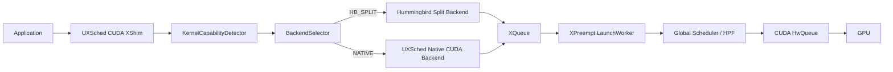

# Hummingbird Split Backend Design

## 1. Goal

HB-XSched keeps UXSched as the only scheduler and the only CUDA hook entry. The
Hummingbird-derived part is an optional CUDA backend that can turn a verified
low-priority CUDA kernel launch into multiple shorter split commands before the
commands enter XQueue.

The first implementation stage targets only CUDA Level 1 blocking preemption:

- Global Scheduler / HPF still decides which XQueue is runnable.
- HP kernels are always passed through to the native UXSched path.
- LP kernels are split only when they are transformable and explicitly verified.
- Unsupported kernels, unsupported launch formats, and missing PTX safely fall
  back to native UXSched when strict mode is off.

## 2. Runtime Architecture



UXSched controls queue scheduling, suspend/resume, XPreempt, XQueue IPC, and
progressive launch. The HB backend only builds transformed functions and split
kernel commands.

## 3. Backend Modes

Runtime selection is controlled by:

- `UXSCHED_CUDA_PREEMPT_BACKEND=NATIVE|HB_SPLIT|AUTO`
- `UXSCHED_HB_SPLIT_BLOCKS=512`
- `UXSCHED_HB_STRICT=0|1`
- `UXSCHED_HB_LOG_LEVEL=INFO|OFF`
- `UXSCHED_HB_VERIFIED_KERNELS=<comma-separated PTX entry names>`

`NATIVE` leaves the existing UXSched path unchanged. `AUTO` and `HB_SPLIT`
enable capability detection, but only LP kernels can be split. `STRICT=0`
falls back to native UXSched when a kernel is not splittable. `STRICT=1` returns
a CUDA error for debugging when an expected split path is unsupported.

`UXSCHED_HB_VERIFIED_KERNELS` is required for splitting because runtime PTX
analysis cannot prove full block independence, non-persistence, and semantic
equivalence. The detector still checks PTX availability, transform success,
recognized cross-block synchronization, offset support, launch format, Level 1,
and XQueue availability.

## 4. Capability Model

Each original `CUfunction` can be associated with:

```cpp
struct KernelCapability {
    bool ptx_available;
    bool transform_attempted;
    bool transform_succeeded;
    bool supports_offset_x;
    bool supports_offset_y;
    bool supports_offset_z;
    bool cooperative;
    bool persistent;
    bool cross_block_sync;
    bool supports_kernel_params;
    bool supports_extra;
    bool splittable;
    std::string fallback_reason;
};
```

Unsupported or unknown conditions default to `splittable=false`. The first
stage supports `kernelParams` only; CUDA `extra` launch format uses native
fallback.

## 5. Module Strategy

The design deliberately does not replace the application-visible module.
Instead:

1. UXSched loads the original module through the real CUDA Driver API.
2. If LP, Lv1, PTX, and verified kernel conditions are satisfied, UXSched also
   loads a hidden transformed module.
3. `cuModuleGetFunction` returns the original function to the application.
4. UXSched records a mapping from original `CUfunction` to hidden transformed
   `CUfunction`.
5. Native fallback always launches the original function, so fallback remains
   ABI-safe.

This avoids the common failure mode where a transformed function gains three
offset parameters but a later fallback still uses the original argument list.

## 6. Split Semantics

For a splittable LP launch:

- Original grid `(gx, gy, gz)` is decomposed into boxes with at most
  `UXSCHED_HB_SPLIT_BLOCKS` blocks.
- Each child command uses the transformed function.
- Each child command receives the original arguments plus
  `offset_x/offset_y/offset_z`.
- All children are submitted to the same XQueue in original stream order.
- A `SplitCommandGroup` tracks child completion and clears ownership after all
  children complete.
- The LP XQueue launch threshold is set to `1,1` once for HB-split queues.

Subsequent stream operations, event records, and stream/device synchronization
remain ordered by the existing XQueue command buffer because the original launch
is expanded before the next intercepted command is submitted.

## 7. Explicit Non-Goals for Stage 1

The current implementation does not implement:

- automatic split size selection;
- online kernel profiling;
- bubble detection;
- split-kernel consolidation;
- kernel-tick scheduling;
- CUDA Graph splitting;
- combined HB split with Lv2/Lv3 guardian/instrumentation;
- cuBLAS/cuDNN closed kernel splitting;
- CUTLASS-specific split validation.

